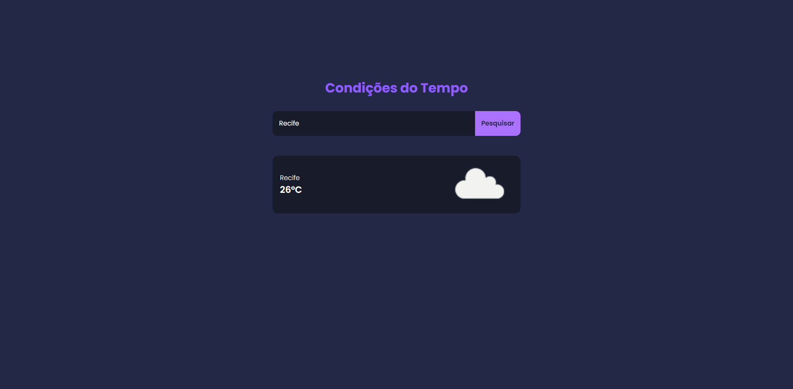

# Condições do Tempo

Projeto React desenvolvido com Vite para consultar e exibir as condições climáticas de uma localização informada pelo usuário.



## Visão Geral

- **Framework:** [React](https://reactjs.org/)
- **Ferramenta de Build:** [Vite](https://vitejs.dev/)
- **Estilização:** CSS personalizado
- **API de Dados:** Integração com a [OpenWeather API](https://openweathermap.org/)

## Funcionalidades

- Busca as condições climáticas baseado na entrada do usuário.
- Exibe a temperatura e a localização retornada pela API.
- Mostra um ícone representativo do clima.
- Apresenta mensagens de erro para localizações inválidas ou problemas na requisição.

## Estrutura do Projeto

- `public/`  
  Contém arquivos estáticos, como o ícone do Vite.

- `src/`
  - `App.jsx`  
    Componente principal que renderiza o componente [Condicao](src/components/Condicao/Condicao.jsx).
  - `components/Condicao/Condicao.jsx`  
    Componente que realiza a chamada à API do OpenWeather e exibe os dados do clima.
  - `assets/`  
    Contém imagens e outros recursos (ex: `clima.png`).

- Arquivos de configuração:
  - [vite.config.js](vite.config.js)
  - [eslint.config.js](eslint.config.js)
  - [package.json](package.json)

## Como Usar

1. **Instalação das dependências**:
   ```sh
   npm install
   ```
2. **Rodar o servidor de desenvolvimento**:
  ```sh
  npm run dev
  ```
O projeto ficará disponível em http://localhost:3000 (a porta pode variar conforme configuração).

## Configurações da API

No componente Condicao.jsx a API do OpenWeather é chamada utilizando uma API key definida diretamente na URL da requisição. Verifique se a API key (appid) está correta para assegurar o funcionamento adequado.

## Licença

Projeto desenvolvido para fins educativos e demonstrativos.

Projeto realizado por [Swetony Ancelmo](https://github.com/swetonyancelmo)